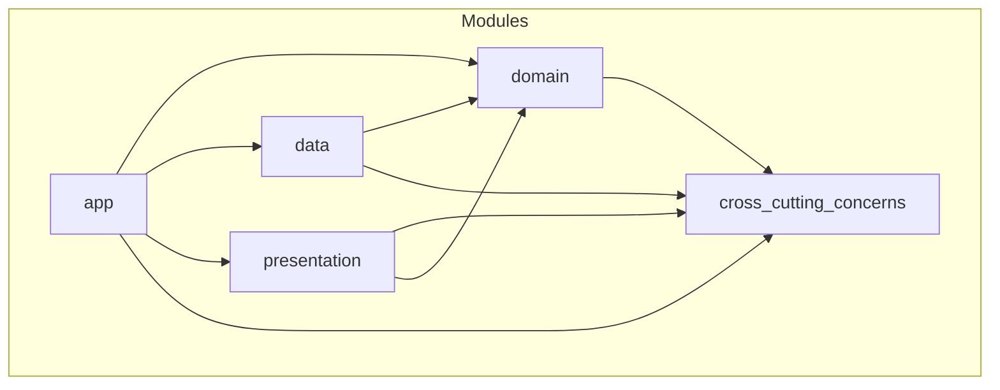

# Flutter Modularized Dependency Injection

## About

In this repository, you'll find the **Flutter Counter App** that has been restructured into a basic
set of packages. This restructuring demonstrates a method of modularizing. The packages are designed
to be cohesive and encapsulate as much details as possible. They register their own dependencies
internally and only expose what is absolutely necessary.

## Packages Dependencies Diagram



## DI Abstractions

The DI abstractions reside in [cross_cutting_concerns -> di](/packages/cross_cutting_concerns/lib/src/di/),
but listed here as well to convey the overall idea.

```dart
abstract interface class DI {
  T call<T extends Object>({String? instanceName});

  T get<T extends Object>({String? instanceName});

  T getWithParam<T extends Object, P>(
    P param, {
    String? instanceName,
  });
}


typedef FactoryFunc<T> = T Function();
typedef FactoryWithParamFunc<T, P> = T Function(P param);
typedef DisposingFunc<T> = FutureOr<void> Function(T instance);

/// This interface must be exposed only to [ModuleDependencies] and the actual
/// implementation of the DI abstraction, the rest should just use [DI]
/// interface.
abstract interface class DIRegistrar implements DI {
  void registerFactory<T extends Object>(
    FactoryFunc<T> factoryFunc, {
    String? instanceName,
  });

  void registerFactoryWithParam<T extends Object, P1>(
    FactoryWithParamFunc<T, P1> factoryFunc, {
    String? instanceName,
  });

  void registerSingleton<T extends Object>(
    T instance, {
    String? instanceName,
    DisposingFunc<T>? disposingFunc,
  });

  void registerLazySingleton<T extends Object>(
    FactoryFunc<T> factoryFunc, {
    String? instanceName,
    DisposingFunc<T>? disposingFunc,
  });
}


/// This abstract class must be implemented by all the modules that have
/// dependencies. The modules are supposed to encapsulate the implementation
/// details and expose only what is necessary.
abstract class ModuleDependencies {
  Future<void> register(DIRegistrar di);

  Future<void> runPostRegistrationActions(DIRegistrar di) => Future.value();
}

```

## DI Abstractions Usage

The modules are expected to honor encapsulation as much as possible.

For example, the fact that [presentation](/packages/presentation/) package uses
[flutter_bloc](https://pub.dev/packages/flutter_bloc) state management is an implementation detail,
so it can be easily replaced just inside this package without the need to modify the other package
at all.

```dart
class PresentationModuleDependencies extends ModuleDependencies {
  @override
  Future<void> register(DIRegistrar di) async {
    di.registerFactory<CounterCubit>(
      () => CounterCubit(di()),
    );
  }
}
```

The usage of [shared_preferences](https://pub.dev/packages/shared_preferences) in the
[data](./packages/data/) package is also "know" only to the package itself.

```dart
class DataModuleDependencies extends ModuleDependencies {
  @override
  Future<void> register(DIRegistrar di) async {
    final sharedPreferences = await SharedPreferences.getInstance();

    di.registerFactory<CounterRepository>(
      () => SharedPreferencesCounterRepository(sharedPreferences),
    );
  }
}
```

The application, of course, will have the transitive dependencies on `shared_preferences` and
`flutter_bloc` as this is inevitable and intended for the root package that eventually will
bundle everything together in an artifact, e.g. IPA/APK.

At the initialization phase of the application, we simply go through all the configured modules
and tell them to register their own dependencies.

```dart
final di = GetItDI();

final modules = <ModuleDependencies>[
  DomainModuleDependencies(),
  PresentationModuleDependencies(),
  DataModuleDependencies(),
];

for (final module in modules) {
  await module.register(di);
}

for (final module in modules) {
  await module.runPostRegistrationActions(di);
}

runApp(App(di: di));

```
